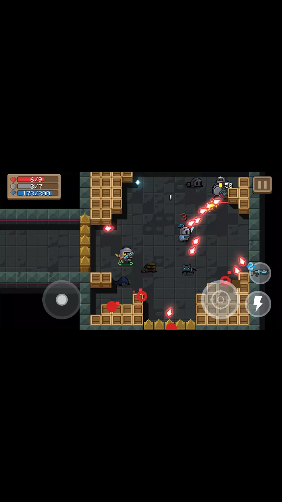
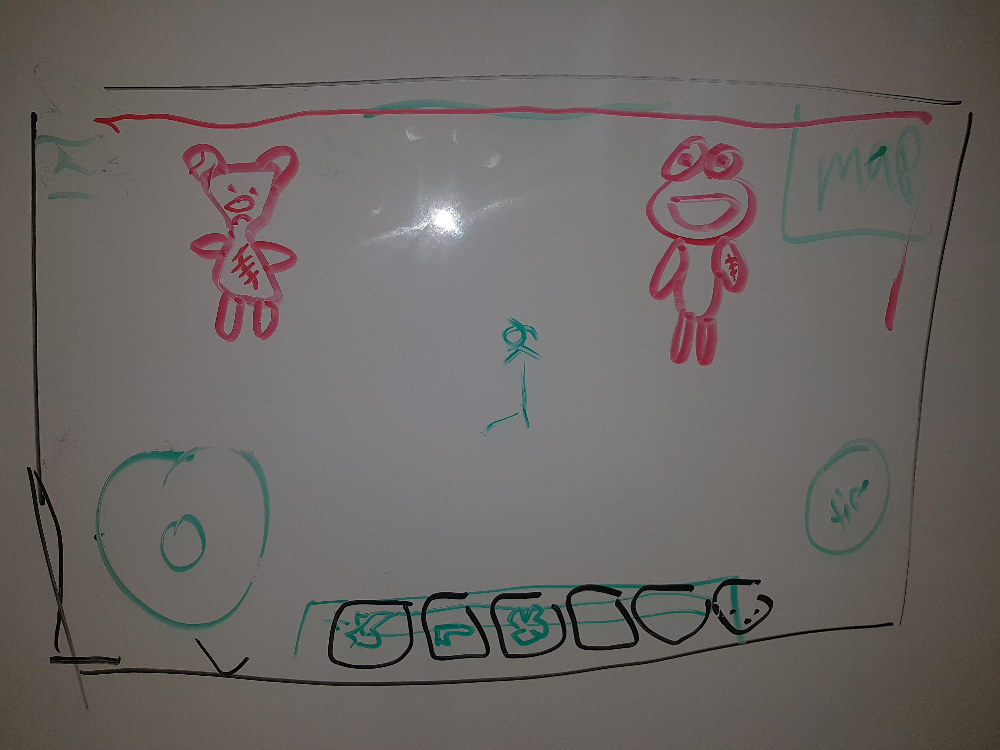
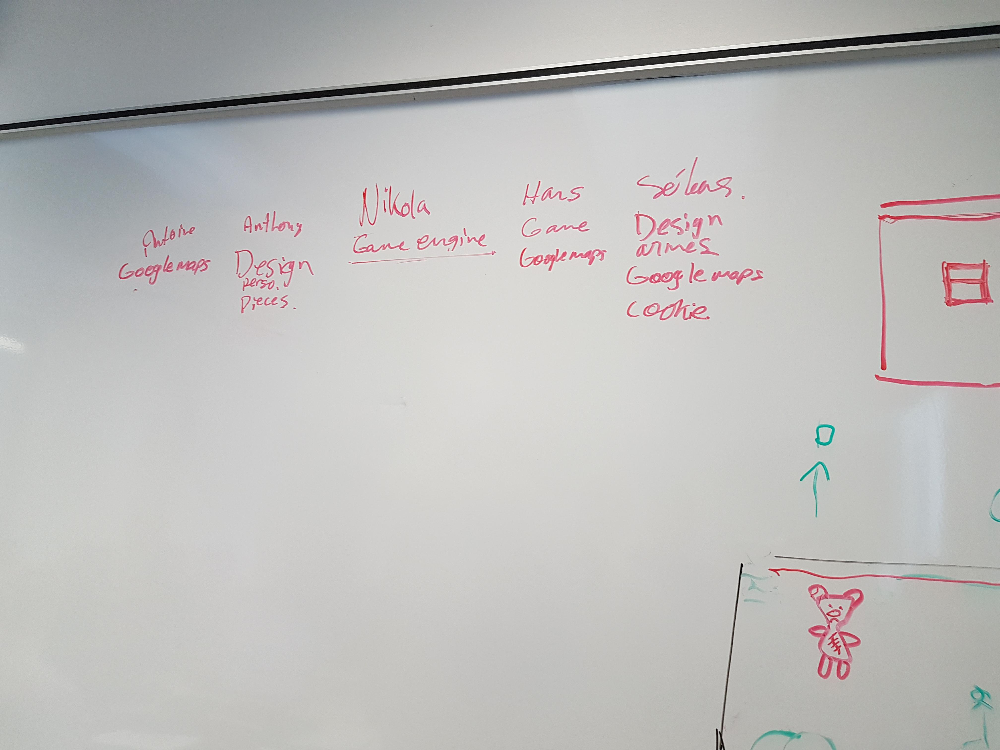

# SIM-2018
Projet intégrateur SIM

## Day 'n' Night

### Description

Un enfant se déplace dans une ville le jour à la recherche d'objets et rêve la nuit à propos d'un jeux vidéo.

**Nuit (Quand l'enfant dort)**
Un enfant rêve à un jeux vidéo dans lequel il doit se défendre contre des toutous. Le rêve se déroule dans un monde style maison qui contient une cuisine en son centre. La cuisine agit en tant que "safe zone". L'attaque des toutous se déroule en vagues dont la difficulté augmente en changeant de vague.

**Jour (Quand l'enfant est réveillé)**
Pendant que l'enfant est réveillé, il peut promène dans la ville (ville réelle visionné à l'aide de google maps) pour trouver des objets qui l'aideront à se défendre dans son rêve.

**Objets**
- Les objets peuvent être de l'argent virtuelle, des armes, des "skins", etc.
- Les objets peuvent être retrouvés à des points d'interêts de la ville.
- Les objets sont classés en catégories de rareté. (e.g. commun, rare, epic...)

**Personnages**
- Arthur ? (Hero, enfant)
- Ennemies (Toutou...)

### Design
- Pixel art

- Contrôles du rêve

### Développement

- Design des pesonnages, pièces [Anthony - leader design]

- Design des objets et de la monnaie [Sébastien]

- Google maps (voir section **Jour**) [Antoine - leader Google maps]

- Google maps [Hans]

- Google maps [Sébastien]

- Moteur de jeu [Nikola]

- Implémentation du jeux [Hans]

- Mécaniques de jeu [?]

- Histoire [?]

